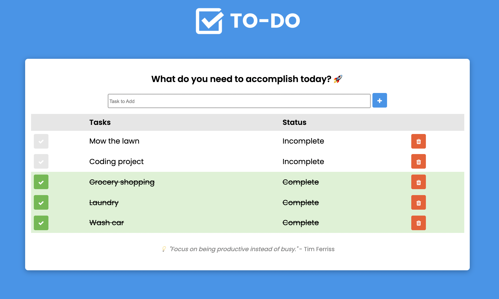

# Weekend Challenge: SQL To-Do List

## Description
Full stack "TO DO" list application that allows users to manage tasks. This project utilizes Node.js, Express, jQuery, PostgreSQL, HTML, and CSS. This project implements server and client side functionality to create, read, update, and delete tasks on the server, client, and database. This project was created by [Steve Savstrom](https://www.linkedin.com/in/stevesavstrom/) during Week 9 of the [Full Stack Software Engineering program](https://www.primeacademy.io/courses/engineering#curriculum) at [Prime Digital Academy](https://www.primeacademy.io/).

- Users can enter and add new tasks to a list.
- Tasks are stored inside a database (SQL) and displayed on the DOM.
- When a task is created, the page is refreshed and all tasks are displayed.
- Each task as the option to mark "Complete" or "Delete" and the database is updated.
- Clean, minimal user interface with visual cues for each user action (add, complete, delete.)

## Screen Shot

## Technologies Used and Prerequisites
- [Node.js](https://nodejs.org/en/)
- [Express](https://expressjs.com/)
- [jQuery](https://jquery.com/)
- [PostgreSQL](https://www.postgresql.org/)
- [Postico](https://eggerapps.at/postico/)

## Installation
1. Create a SQL database named `weekend-to-do-app`.
2. Open your text editoy and run `npm intall`.
3. Run `npm init -y`in your terminal.
4. Run `npm install express`in your terminal.
5. Run `npm install pg`in your terminal.

## Usage
Having trouble keeping track of all your tasks in your head? This app can help with that. Type in your task, click the `+` button and feel a sense of relief that you are taking a step toward organization and productivity. Keep adding tasks to your list until you are ready to get to work. As you complete tasks throughout the day, give yourself the satisfaction of marking them as done using the `check` button and watch them get crossed off the list. Added something by mistake? Simply click the red `trash` button to remove it from your last. Aren't lists great?

## Project Requirements
[x] Front end experience that allows a user to create a Task.

[x] When the Task is created, it should be stored inside of a database (SQL).

[x] Whenever a Task is created the front end should refresh to show all tasks that need to be completed.

[x] Each Task should have an option to 'Complete' or 'Delete'.

[x] When a Task is complete, its visual representation should change on the front end. For example, the background of the task container could change from gray to green. The complete option should be 'checked off'.

[x] Whether or not a Task is complete should also be stored in the database.

[x] Deleting a Task should remove it both from the front end as well as the Database.

[x] Use CSS styling to move the aesthetic of the page beyond the vanilla HTML look.